<p align="center">
  
</p>

<div align="center">

# YFG Comical ComfyUI Custom Nodes 

</div>

A collection of ComfyUI utility custom nodes. Hope these provide some functionality not offered in the core app or other custom nodes. Some nodes take existing nodes and add enhanced functionality and/or improved quality of life features. 

- [YFG Comical ComfyUI Custom Nodes](#yfg-comical-comfyui-custom-nodes)
  * [Nodes](#nodes)
    + [Image Histograms Generator](#image-histograms-generator)
    + [Image Histograms Generator (compact)](#image-histograms-generator--compact-)
    + [Image Halftone Generator](#image-halftone-generator)
    + [Image Side by Side](#image-side-by-side)
    + [Image to imgBB](#image-to-imgbb)
      - [Setup](#setup)
    + [Smart Checkpoint Loader](#smart-checkpoint-loader)
    + [Mono Clip](#mono-clip)
    + [VAE  Decode with Preview](#vae--decode-with-preview)
    + [Image to Contrast Mask](#image-to-contrast-mask)
    + [PixelArt](#pixelart)
    + [Text Mask Overlay](#text-mask-overlay)
    + [Image Switchers](#image-switchers)
    + [Random.org True Random Number](#randomorg-true-random-number)
  * [Examples](#examples)
    + [Sample Workflow](#sample-workflow)
  * [All nodes as of 06-13-2024](#all-nodes-as-of-06-13-2024)
  * [Acknowledgements](#acknowledgements)

<small><i><a href='http://ecotrust-canada.github.io/markdown-toc/'>Table of contents generated with markdown-toc</a></i></small>


## Nodes

### Image Histograms Generator

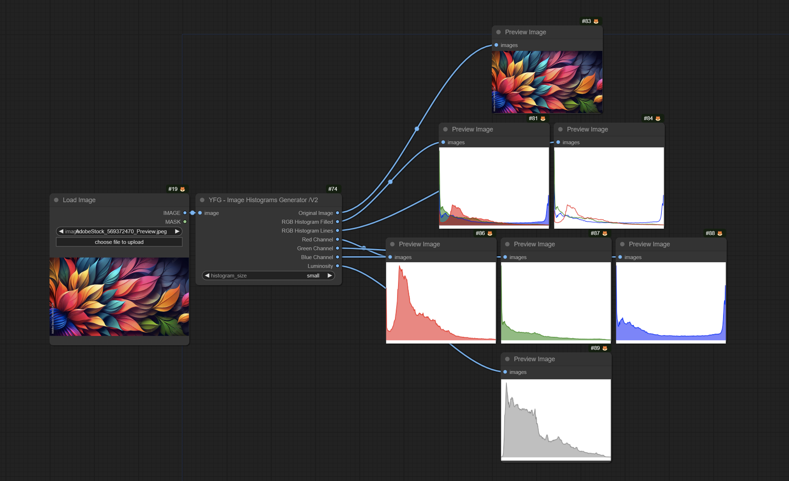

This node allows you to take an input image, calculate its histogram for the color channels as well as the L channel and display a graphical representation of the data.

### Image Histograms Generator (compact)

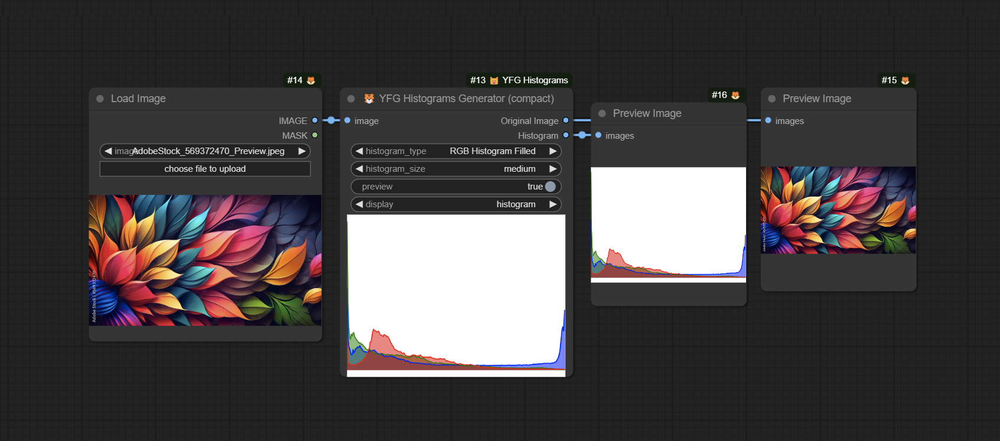

This version of the node reduces the number of outputs to just two: Original and Histogram. You have a choice of using the node as a preview node and chose what to display in the node: The selected Histogram or the Orginal Image. The Histogram output will send the selected Histogram to the next node. 

### Image Halftone Generator

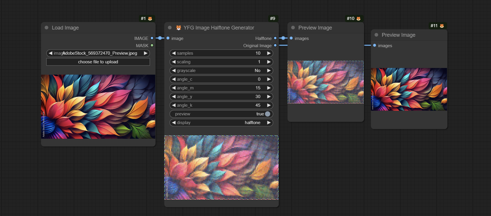

*This node is based on original code by Phil Gyford https://github.com/philgyford/python-halftone and ComfyUI node by aimingfail https://civitai.com/models/143293/image2halftone-node-for-comfyui*

This node generates a halftone image from the input image. It can self-display and send the output to other downstream nodes. You have a choice of displaying the Original Image or the generated Halftone image. The display can also be turned off. 

### Image Side by Side

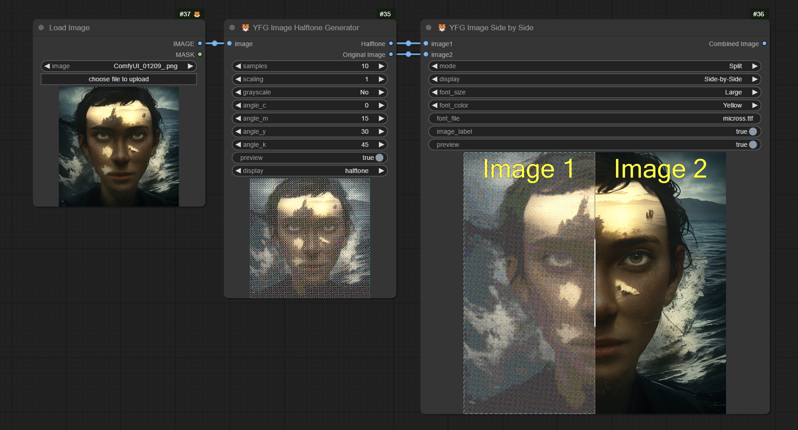

This node generates either a Side-by-Side image of a Split image from two input images. You can turn on node self-preview or send the resulting image to other downstream nodes. The header labels can be turned off and the font, size and color can also be selected. 

Here is an example of the images Side by Side instead of split.

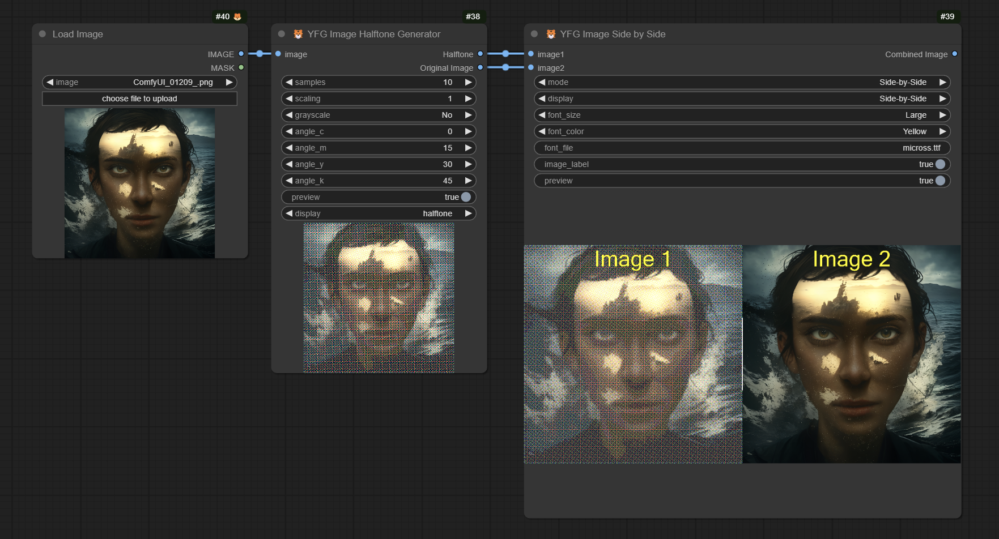

### Image to imgBB

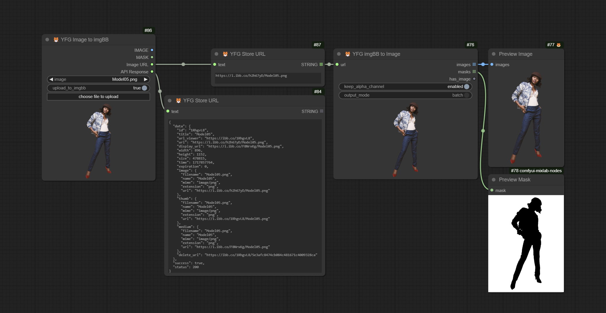

These nodes enable uploading and downloading to / from the [imgBB](https://www.imgbb.com/) image sharing service. Also included are nodes for downloading images from imgBB and an image URL node that preserves the uploaded image URL in the workflow for easy sharing of originals with others. 
Perfect for sharing workflows while making original images available for others. 

#### Setup

In order to use these nodes, you must have an account with imgBB service. Once you have your account, navigate to [`https://api.imgbb.com/`](https://api.imgbb.com) and generate an API key. You will need to configure this key in the `imgbb_api_key.json` file in the node's subfolder `./loaders/`. 
There is a sample file `imgbb_api_key_example.json` you can copy and rename to `imgbb_api_key.json`, edit it and enter your API key replacing the text `"YOUR_API_KEY_HERE"` with your key. See example below.  

>     {
>       "api_key": "8a54a1b12353d43105d62fxadr3286a3323x"
>     }

### Smart Checkpoint Loader

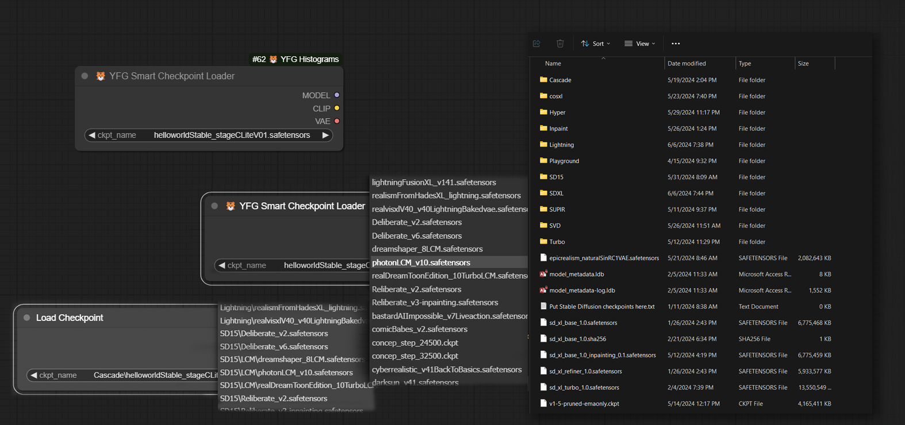

This is a one-for-one replacement of the core Load Checkpoint node with one key difference: It flattens your directory structure regardless of how complex and makes all checkpoints appear as if on one folder. This is ideal for sharing workflows where the original author may have
a different directory structure than other users. Makes organizing checkpoints and sharing workflows easier. 

### Mono Clip

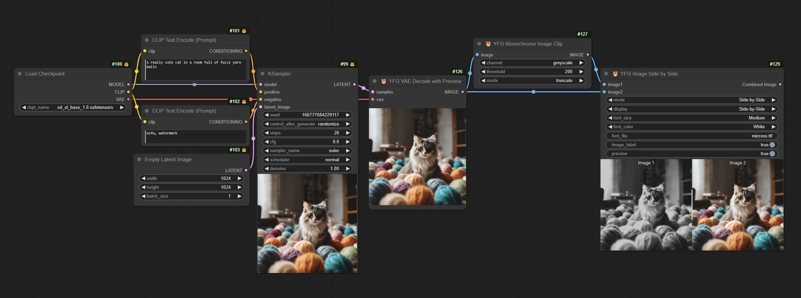

Generates a black and white or greyscale clipped image. Choice of three options with reverse mode for each. Suitable for masking and special effects. 

*This node is based on original code by XSS https://civitai.com/models/24869?modelVersionId=29755*

### VAE  Decode with Preview

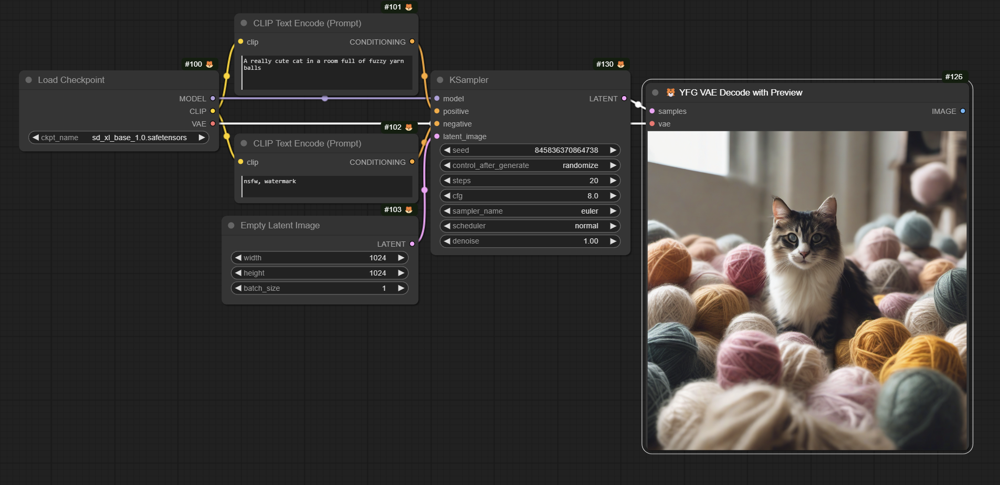

Generates a black and white or greyscale clipped image. Choice of three options with reverse mode for each. Suitable for masking and special effects. 

*This node is based on original code by XSS https://civitai.com/models/24869?modelVersionId=47776*

### Image to Contrast Mask

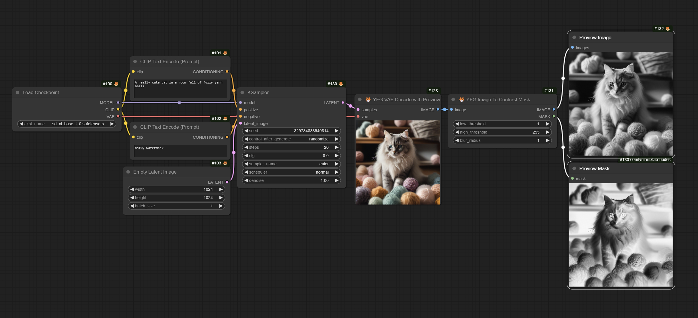

Generates a greyscale contrast mask. Threshold is selectable between 1 and 255 for low and high values. Optionally blur the output. 

*This node is based on original code by XSS https://civitai.com/models/24869?modelVersionId=32717*

### PixelArt

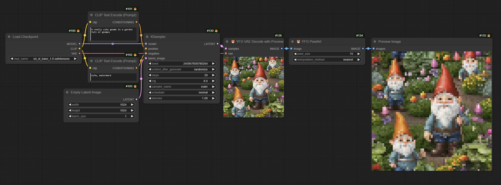

Generates a Pixel Art style image. Optionally select the interpolation mode and number of pixels. 

*This node is based on original Mosaic code by XSS https://civitai.com/models/24869?modelVersionId=29750*

### Text Mask Overlay

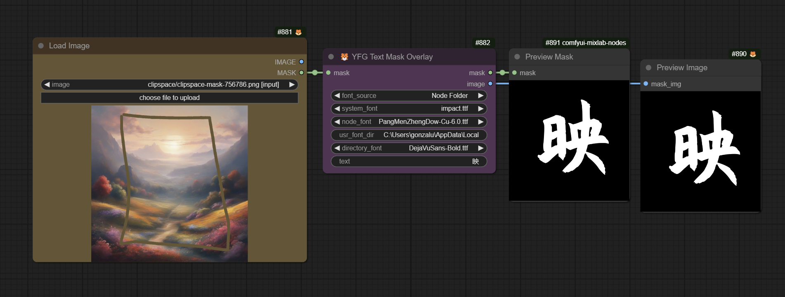

This node takes the original idea by Yuigahama Yui and adds a few enhancements. 

- Font Selection: You have the option of selecting from System Fonts, User fonts or local fonts in the node directory (under the folder ./fonts/ in the custom node directory) 
<p align="center">
  
</p>

<div align="center">

# YFG Comical ComfyUI Custom Nodes 

</div>

A collection of ComfyUI utility custom nodes. Hope these provide some functionality not offered in the core app or other custom nodes. Some nodes take existing nodes and add enhanced functionality and/or improved quality of life features. 

- [YFG Comical ComfyUI Custom Nodes](#yfg-comical-comfyui-custom-nodes)
  * [Nodes](#nodes)
    + [Image Histograms Generator](#image-histograms-generator)
    + [Image Histograms Generator (compact)](#image-histograms-generator--compact-)
    + [Image Halftone Generator](#image-halftone-generator)
    + [Image Side by Side](#image-side-by-side)
    + [Image to imgBB](#image-to-imgbb)
      - [Setup](#setup)
    + [Smart Checkpoint Loader](#smart-checkpoint-loader)
    + [Mono Clip](#mono-clip)
    + [VAE  Decode with Preview](#vae--decode-with-preview)
    + [Image to Contrast Mask](#image-to-contrast-mask)
    + [PixelArt](#pixelart)
    + [Text Mask Overlay](#text-mask-overlay)
    + [Image Switchers](#image-switchers)
  * [Examples](#examples)
    + [Sample Workflow](#sample-workflow)
  * [All nodes as of 06-13-2024](#all-nodes-as-of-06-13-2024)
  * [Acknowledgements](#acknowledgements)

<small><i><a href='http://ecotrust-canada.github.io/markdown-toc/'>Table of contents generated with markdown-toc</a></i></small>


## Nodes

### Image Histograms Generator


This node allows you to take an input image, calculate its histogram for the color channels as well as the L channel and display a graphical representation of the data.

### Image Histograms Generator (compact)


This version of the node reduces the number of outputs to just two: Original and Histogram. You have a choice of using the node as a preview node and chose what to display in the node: The selected Histogram or the Orginal Image. The Histogram output will send the selected Histogram to the next node. 

### Image Halftone Generator


*This node is based on original code by Phil Gyford https://github.com/philgyford/python-halftone and ComfyUI node by aimingfail https://civitai.com/models/143293/image2halftone-node-for-comfyui*

This node generates a halftone image from the input image. It can self-display and send the output to other downstream nodes. You have a choice of displaying the Original Image or the generated Halftone image. The display can also be turned off. 

### Image Side by Side


This node generates either a Side-by-Side image of a Split image from two input images. You can turn on node self-preview or send the resulting image to other downstream nodes. The header labels can be turned off and the font, size and color can also be selected. 

Here is an example of the images Side by Side instead of split.


### Image to imgBB


These nodes enable uploading and downloading to / from the [imgBB](https://www.imgbb.com/) image sharing service. Also included are nodes for downloading images from imgBB and an image URL node that preserves the uploaded image URL in the workflow for easy sharing of originals with others. 
Perfect for sharing workflows while making original images available for others. 

#### Setup

In order to use these nodes, you must have an account with imgBB service. Once you have your account, navigate to [`https://api.imgbb.com/`](https://api.imgbb.com) and generate an API key. You will need to configure this key in the `imgbb_api_key.json` file in the node's subfolder `./loaders/`. 
There is a sample file `imgbb_api_key_example.json` you can copy and rename to `imgbb_api_key.json`, edit it and enter your API key replacing the text `"YOUR_API_KEY_HERE"` with your key. See example below.  

>     {
>       "api_key": "8a54a1b12353d43105d62fxadr3286a3323x"
>     }

### Smart Checkpoint Loader


This is a one-for-one replacement of the core Load Checkpoint node with one key difference: It flattens your directory structure regardless of how complex and makes all checkpoints appear as if on one folder. This is ideal for sharing workflows where the original author may have
a different directory structure than other users. Makes organizing checkpoints and sharing workflows easier. 

### Mono Clip


Generates a black and white or greyscale clipped image. Choice of three options with reverse mode for each. Suitable for masking and special effects. 

*This node is based on original code by XSS https://civitai.com/models/24869?modelVersionId=29755*

### VAE  Decode with Preview


Generates a black and white or greyscale clipped image. Choice of three options with reverse mode for each. Suitable for masking and special effects. 

*This node is based on original code by XSS https://civitai.com/models/24869?modelVersionId=47776*

### Image to Contrast Mask


Generates a greyscale contrast mask. Threshold is selectable between 1 and 255 for low and high values. Optionally blur the output. 

*This node is based on original code by XSS https://civitai.com/models/24869?modelVersionId=32717*

### PixelArt


Generates a Pixel Art style image. Optionally select the interpolation mode and number of pixels. 

*This node is based on original Mosaic code by XSS https://civitai.com/models/24869?modelVersionId=29750*

### Text Mask Overlay


This node takes the original idea by Yuigahama Yui and adds a few enhancements. 

- Font Selection: You have the option of selecting from System Fonts, User fonts or local fonts in the node directory (under the folder ./fonts/ in the custom node directory) 
- Mask-to-Image is handled in the node so no need for an external converter. 

Here is a sample image output using the node. 

| <a href="img/textMaskOverlay01original.png"></a> | <a href="img/textMaskOverlay01.png"></a> |
| :-: | :-: |
| Original | Output |

Example [workflow](workflows/ComfyUI_YFG_Comical-Text-Mask-Overlay-Workflow.json) workflow in JSON format. The workflow is also embedded to the linked image below. 

[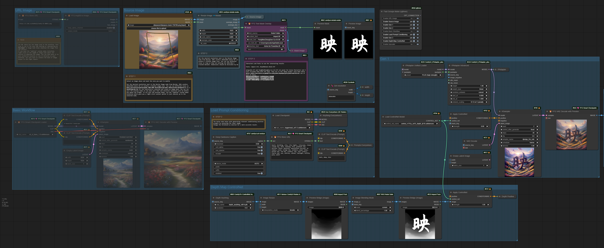](workflows/ComfyUI_YFG_Comical-Text-Mask-Overlay-Workflow.png)

*This node is based on the ComfyUI-Text node by Yuigahama Yui https://github.com/LZpenguin/ComfyUI-Text*

### Image Switchers

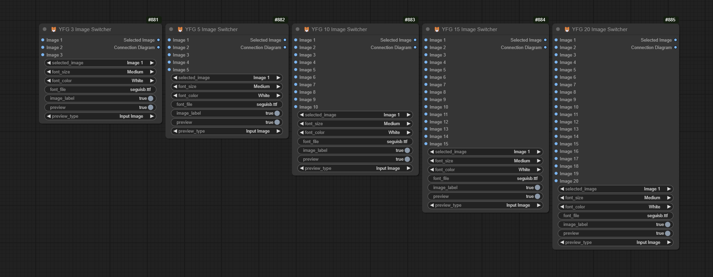

Multi-input image switchers. 3, 5, 10, 15 and 20 input versions. These nodes also have a lot of additional functionality such as a matrix display showing routing and also gives the user to preview the image selected within the node. The nodes also gracefully handle missing inputs and displays a warning to the user that a particular input is empty.

Why these nodes? I have some workflows where I had to gang together existing image switchers which made it cumbersome to keep track of what batch of inputs was switched to an output. 

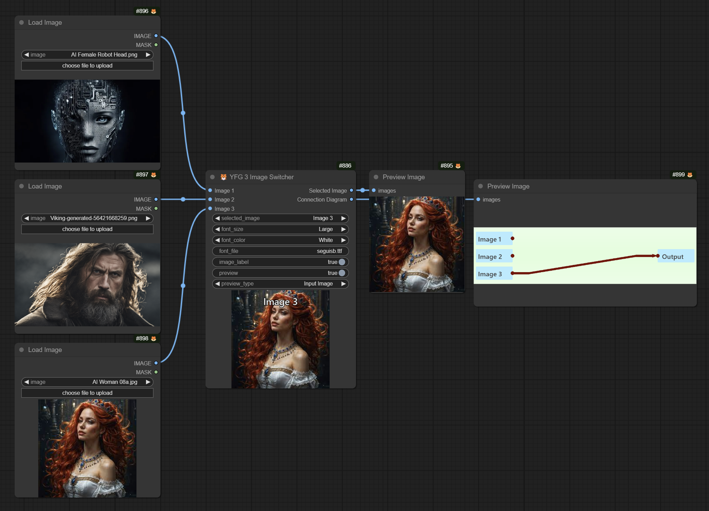

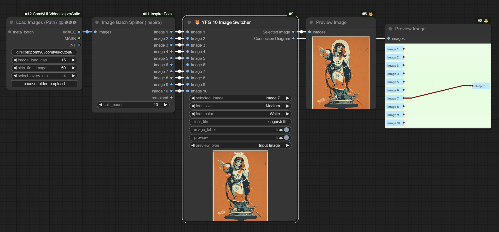

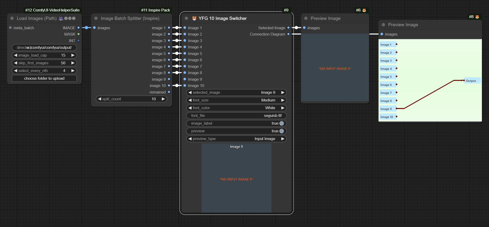

### Random.org True Random Number

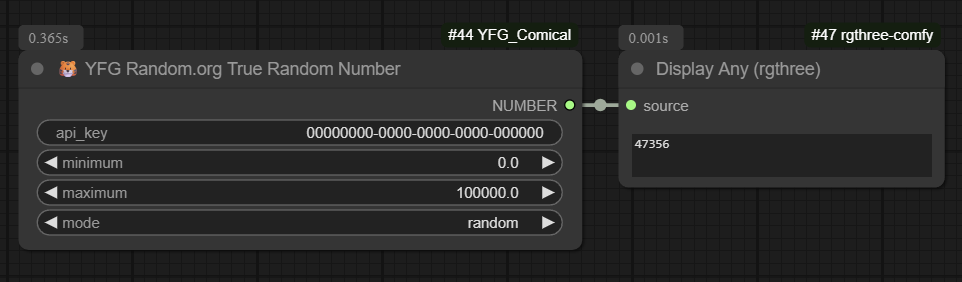

Modified version of original node from WAS node suite since that node is currently not functional. I decided to just modify it myself and remove float and int returns. You will need an account and the <a href="https://api.random.org/dashboard">API</a> key from <a href="https://www.random.org/">Random.org.</a>

*This node is based on original code by WASasquatch https://github.com/WASasquatch/was-node-suite-comfyui*

---

### Random.org True Random Number (V2)

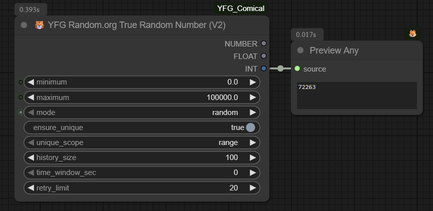

This node integrates with the [random.org JSON-RPC API](https://api.random.org/json-rpc/2/) to generate **true random numbers** directly from atmospheric noise, instead of relying on pseudo-random algorithms.

#### ✨ Features

- **Secure API key handling**  
  API key is never exposed in ComfyUI UI, workflow JSON, or image metadata.  
  Loaded at runtime from:
  1. Environment variable `RANDOM_ORG_API_KEY`, or
  2. A local JSON file `random_org_api_key.json` stored next to the node file.

- **Flexible outputs**  
  Provides three output types for compatibility with downstream nodes:
  - `NUMBER`
  - `FLOAT`
  - `INT`

- **Optional uniqueness filtering**  
  Avoids repeating values within a session:
  - `ensure_unique` → toggle de-duplication
  - `unique_scope` → `"range"` (per `[min, max]`) or `"global"` (all ranges)
  - `history_size` → how many values to remember
  - `time_window_sec` → duplicates ignored if older than this window
  - `retry_limit` → number of re-draw attempts

- **Backwards compatibility**  
  The old `RandomOrgTrueRandomNumber_node` remains available.  
  The new node is registered as `RandomOrgV2TrueRandomNumber_node`.

#### 🔑 API Key Setup

1. Create `random_org_api_key.json` next to `RandomOrgV2.py`:
   ```json
   {
     "api_key": "YOUR_API_KEY_HERE"
   }
   ```

2. Or, set an environment variable before launching ComfyUI:
   
   bash
   ```bash
   export RANDOM_ORG_API_KEY=YOUR_API_KEY_HERE
   ```
   
   powershell
   ```powershell
   setx RANDOM_ORG_API_KEY "YOUR_API_KEY_HERE"
   ```
#### ⚙️ Example Usage

- **Generate random integer between 1 and 100:**

  - `minimum = 1`
  - `maximum = 100`
  - `mode = random`

- **Ensure no repeats in current range:**

  - Enable `ensure_unique`
  - Set `unique_scope = range`
  - Adjust `history_size` and `time_window_sec`

#### 📌 Notes

- Session-lifetime uniqueness: resets when Python restarts.
- Persistence: future versions may add file-based persistence.
- API limits: random.org quotas apply — check your account dashboard.

## Examples

### Sample Workflow

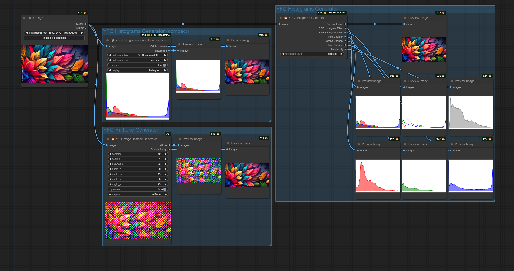

The workflow should be embedded in the file. If you can't get it to load, feel free to download and open the [workflow.json](workflows/ComfyUI_YFG_Comical-Example-Workflow.json) file.

## All nodes as of 06-13-2024

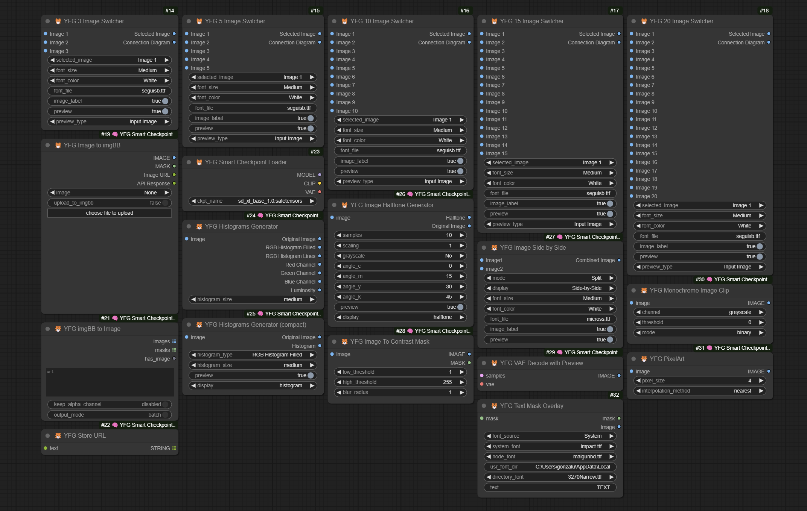

## Acknowledgements

I have to give credit to at least those who's other custom nodes I use quite often and in some cases make my life in ComfyUI all around better.

 - [ComfyUI](https://github.com/comfyanonymous/ComfyUI)
 - [MarasIT](https://github.com/davask/ComfyUI-MarasIT-Nodes)
 - [Dr.Lt.Data](https://github.com/ltdrdata)
 - [melMas](https://github.com/melMass/comfy_mtb)
 - [rgthree](https://github.com/rgthree/rgthree-comfy)
 - [Akatsuzi](https://github.com/Suzie1)
 - [chrisgoringe](https://github.com/chrisgoringe/cg-use-everywhere)
 - [pythongosssss](https://github.com/pythongosssss)

 And many many others too many to name. Your inspiration and talent is really exemplary. Thank you.