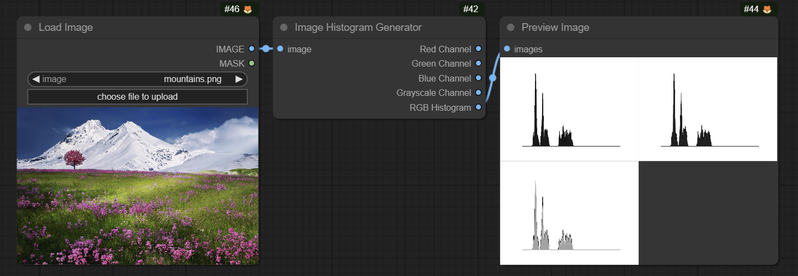
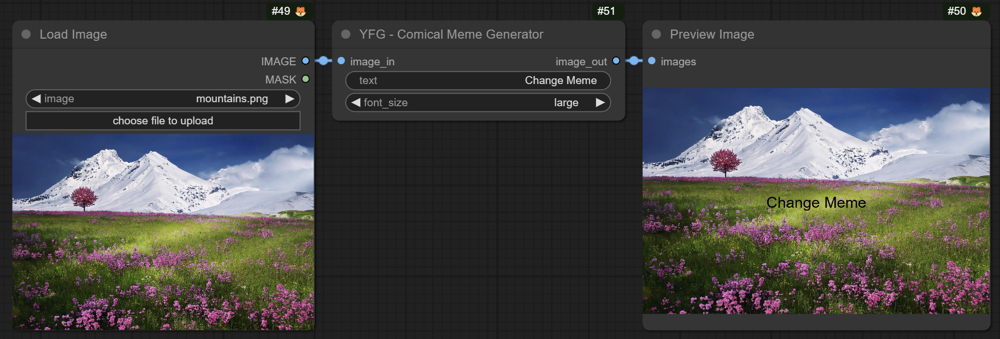
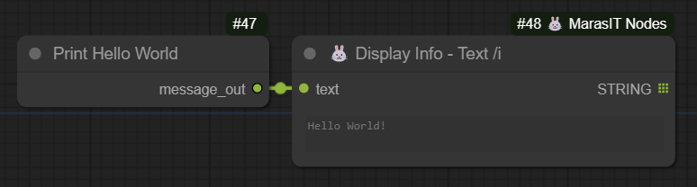

# ComfyUI YouFunnyGuys Comical Custom Nodes

This is a repository of ComfyUI custom nodes. I was looking for a node that provided some functionality and did not find one. So I decided to create one myself in order to have the functionality I desired as well as way to teach myself how to code.

## Acknowledgements

I have to give credit to at least those who's other custom nodes I use quite often and in some cases make my life in ComfyUI all around better.

 - [ComfyUI](https://github.com/comfyanonymous/ComfyUI)
 - [MarasIT](https://github.com/davask/ComfyUI-MarasIT-Nodes)
 - [Dr.Lt.Data](https://github.com/ltdrdata)
 - [rgthree](https://github.com/rgthree/rgthree-comfy)
 - [Akatsuzi](https://github.com/Suzie1)
 - [chrisgoringe](https://github.com/chrisgoringe/cg-use-everywhere)
 - [pythongosssss](https://github.com/pythongosssss)

 And many many others too many to name. Your inspiration and talent is really exemplary. Thank you.

## The nodes so far

### Image Histogram Generator

This node allows you to take an input image, calculate it's histogram for the color channels as well as the L channel and display a graphical representation of the data.

### Meme Generator

OK there are probably 5 or 10 nodes already that do this and do it really well. I made one as I was learning to go beyond "Hello World" 

### Hello World

Obviously this is where everyone starts, right? RIGHT? :roll_eyes:

## Examples

### Sample Workflow

The workflow should be embedded in the file. If you can't get it to load, feel free to download and open the Workflow.json file.
