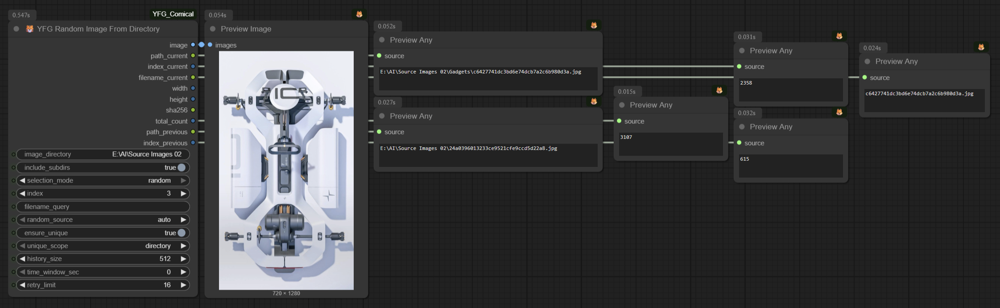

<p align="center">
  
</p>

<div align="center">

# YFG Comical ComfyUI Custom Nodes

</div>

A collection of ComfyUI utility custom nodes. These provide functionality not offered in the core app or other custom nodes. Several nodes enhance existing ideas with improved UX and quality-of-life features.

---

- [YFG Comical ComfyUI Custom Nodes](#yfg-comical-comfyui-custom-nodes)
  * [Nodes](#nodes)
    + [Image Histograms Generator](#image-histograms-generator)
    + [Image Histograms Generator (compact)](#image-histograms-generator-compact)
    + [Image Halftone Generator](#image-halftone-generator)
    + [Image Side by Side](#image-side-by-side)
    + [Image to imgBB](#image-to-imgbb)
      - [Setup](#setup)
    + [Smart Checkpoint Loader](#smart-checkpoint-loader)
    + [Mono Clip](#mono-clip)
    + [VAE Decode with Preview](#vae-decode-with-preview)
    + [Image to Contrast Mask](#image-to-contrast-mask)
    + [PixelArt](#pixelart)
    + [Text Mask Overlay](#text-mask-overlay)
    + [Image Switchers](#image-switchers)
    + [Random.org True Random Number](#randomorg-true-random-number)
    + [Random.org True Random Number (V2)](#randomorg-true-random-number-v2)
	+ [Random Image From Directory](#random-image-from-directory)
  * [Examples](#examples)
    + [Sample Workflow](#sample-workflow)
  * [All nodes as of 06-13-2024](#all-nodes-as-of-06-13-2024)
  * [Acknowledgements](#acknowledgements)

<small><i><a href="http://ecotrust-canada.github.io/markdown-toc/">Table of contents generated with markdown-toc</a></i></small>

---

## Nodes

### Image Histograms Generator


Calculate image histograms for RGB channels and L (luminance); displays a graphical representation.

### Image Histograms Generator (compact)


Reduces outputs to just two: Original and Histogram. Can self-preview (original or histogram) and forward the selected histogram downstream.

### Image Halftone Generator


*Based on original code by Phil Gyford and ComfyUI node by aimingfail.*

Generates halftone from an input image; can self-display or send output to other nodes.

### Image Side by Side


Creates a side-by-side or split image from two inputs. Optional self-preview, headers (font/size/color), and label toggles.

Example (side-by-side instead of split):


### Image to imgBB


Upload and download images to/from [imgBB](https://www.imgbb.com/). Includes nodes for downloading images and a URL “storage” node that keeps the original link alongside the workflow.

#### Setup

Create `imgbb_api_key.json` under `./loaders/`:

```json
{
  "api_key": "YOUR_API_KEY_HERE"
}
```

Obtain a key at <https://api.imgbb.com/>.

### Smart Checkpoint Loader


Drop-in replacement for the core “Load Checkpoint,” but flattens complex directory trees so checkpoints appear as if in a single folder — ideal for sharing workflows.

### Mono Clip


Produces B/W or grayscale clipped images with three modes (each reversible). Useful for masks and stylization.

*Based on original code by XSS.*

### VAE Decode with Preview


VAE decode with inline preview and QoL options.

*Based on original code by XSS.*

### Image to Contrast Mask


Creates a grayscale contrast mask. Select low/high thresholds (1–255), optional blur.

*Based on original code by XSS.*

### PixelArt


Generates pixel-art style images. Choose interpolation and pixel size.

*Based on original Mosaic code by XSS.*

### Text Mask Overlay


Enhances the idea by Yuigahama Yui:

- Choose fonts from System, User, or local `./fonts/` directory.
- Built-in Mask-to-Image conversion (no extra converter needed).

**Example**

| <a href="img/textMaskOverlay01original.png"></a> | <a href="img/textMaskOverlay01.png"></a> |
| :-: | :-: |
| Original | Output |

Example [workflow JSON](workflows/ComfyUI_YFG_Comical-Text-Mask-Overlay-Workflow.json) (also embedded in the image below):

[](workflows/ComfyUI_YFG_Comical-Text-Mask-Overlay-Workflow.png)

*Based on the ComfyUI-Text node by Yuigahama Yui.*

### Image Switchers


Multi-input image switchers (3, 5, 10, 15, 20 inputs). Provide a routing matrix, inline preview, and graceful handling of missing inputs (with user warnings). Designed to avoid “ganged” switcher confusion in complex workflows.


### Random.org True Random Number


Modified version of the WAS node (original wasn’t functioning). Requires a [Random.org](https://www.random.org/) account and [API key](https://api.random.org/dashboard).

*Based on original code by WASasquatch.*

---

### Random.org True Random Number (V2)


Integrates with the [random.org JSON-RPC API](https://api.random.org/json-rpc/2/) to generate **true random numbers** from atmospheric noise.

#### ✨ Features

- **Secure API key handling**  
  Key is **not** exposed in UI, workflow JSON, or image metadata. Loaded at runtime from:
  1. Environment variable `RANDOM_ORG_API_KEY`, or
  2. Local JSON file `random_org_api_key.json` next to `RandomOrgV2.py`.

- **Flexible outputs**  
  Emits three types for broad node compatibility:
  - `NUMBER`
  - `FLOAT`
  - `INT`

- **Optional uniqueness filtering (in-memory)**  
  Avoid repeats within a Python session:
  - `ensure_unique` — toggle de-duplication
  - `unique_scope` — `"range"` (per `[min, max]`) or `"global"` (across all ranges)
  - `history_size` — how many values to remember
  - `time_window_sec` — ignore duplicates older than this window
  - `retry_limit` — extra draws to try before giving up

- **Backwards compatible**  
  Old node remains available as `RandomOrgTrueRandomNumber_node`.  
  New node is `RandomOrgV2TrueRandomNumber_node`.

#### 🔑 API Key Setup

1. Create `random_org_api_key.json` next to `RandomOrgV2.py`:

   ```json
   {
     "api_key": "YOUR_API_KEY_HERE"
   }
   ```

2. Or set an environment variable before launching ComfyUI:

   ```bash
   export RANDOM_ORG_API_KEY=YOUR_API_KEY_HERE
   ```

   On Windows (PowerShell):

   ```powershell
   setx RANDOM_ORG_API_KEY "YOUR_API_KEY_HERE"
   ```

#### ⚙️ Example Usage

- **Generate a random integer between 1 and 100**
  - `minimum = 1`
  - `maximum = 100`
  - `mode = random`

- **Ensure no repeats in the current range**
  - Enable `ensure_unique`
  - Set `unique_scope = range`
  - Adjust `history_size` and `time_window_sec`

#### 📌 Notes

- **Session-lifetime uniqueness** resets when Python restarts.  
- **Persistence** (disk-based history) may be added in a future version.  
- **API limits**: Random.org quotas apply — check your dashboard.

### Random Image From Directory



This node selects a single image from a given directory (with optional recursion into subdirectories).  
It supports **true randomness** (via Random.org integration if configured) or deterministic selection by index/filename.  
It also tracks previously selected images so you can compare “current” vs “previous” outputs.

#### ✨ Features
- **Directory traversal**
  - Select only from the top folder, or include all subdirectories.
- **Multiple selection modes**
  - `random`: choose a random image (true random if Random.org is enabled, otherwise local PRNG).
  - `by_index`: pick image by numeric index (safe wraparound).
  - `by_filename`: select a file by exact name or substring.
  - `by_query`: glob-style matching (`*.png`, `cat*`, etc.), random among matches.
- **Uniqueness filtering**
  - Avoids repeating the same file within the same session.
  - Scope can be per-directory or global.
  - Adjustable `history_size` and `time_window_sec` for fine control.
- **Metadata outputs**
  - Current/previous file info, image size, and SHA256 hash of the file.
  - Also reports `total_count` = number of eligible images found.

#### 🔧 Input Parameters
- **`image_directory`** *(string)* – Path to the folder containing images.  
- **`include_subdirs`** *(bool, default: True)* – Whether to scan subdirectories.  
- **`selection_mode`** *(choice, default: random)* – Image selection method.  
- **`index`** *(int)* – Used when `selection_mode=by_index`.  
- **`filename_query`** *(string)* – Used when `selection_mode=by_filename` or `by_query`.  
- **`random_source`** *(choice, default: auto)* –  
  - `auto`: use Random.org if API key is configured, else local PRNG.  
  - `local`: always use local PRNG.  
  - `random_org`: force Random.org usage (requires API key).  
- **`ensure_unique`** *(bool)* – Prevent repeats during a session.  
- **`unique_scope`** *(choice)* – `"directory"` or `"global"`.  
- **`history_size`** *(int, default: 512)* – Max remembered items.  
- **`time_window_sec`** *(int, default: 0)* – Forget items older than this many seconds.  
- **`retry_limit`** *(int, default: 16)* – Max retries when avoiding duplicates.

#### 🖥️ Outputs
1. **`image`** – The loaded image tensor.  
2. **`path_current`** – Full path of the selected image (current).  
3. **`index_current`** – Index of the selected image (current).  
4. **`filename_current`** – Filename of the selected image.  
5. **`width`** – Width of the image in pixels.  
6. **`height`** – Height of the image in pixels.  
7. **`sha256`** – SHA256 checksum of the file (useful for deduplication).  
8. **`total_count`** – Total number of eligible images discovered in the directory (after filters).  
9. **`path_previous`** – Full path of the image from the previous run.  
10. **`index_previous`** – Index of the image from the previous run.  

#### 🔑 Random.org Setup (optional)
- To enable true randomness, place your API key in `random_org_api_key.json` next to the node:
1. Create `random_org_api_key.json` next to `RandomOrgV2.py`:

   ```json
   {
     "api_key": "YOUR_API_KEY_HERE"
   }
   ```

2. Or set an environment variable before launching ComfyUI:

   ```bash
   export RANDOM_ORG_API_KEY=YOUR_API_KEY_HERE
   ```

   On Windows (PowerShell):

   ```powershell
   setx RANDOM_ORG_API_KEY "YOUR_API_KEY_HERE"
   ```
#### 📌 Notes

- **Current vs previous outputs** make it easy to compare selections.
- **Session-lifetime uniqueness** resets when Python restarts.
- **Persistence** future versions may add file-based persistence.  
- **API limits**: Random.org quotas apply — check your dashboard.

---

## Examples

### Sample Workflow


If the embedded workflow doesn't load, use the JSON:  
[workflows/ComfyUI_YFG_Comical-Example-Workflow.json](workflows/ComfyUI_YFG_Comical-Example-Workflow.json)

## All nodes as of 06-13-2024


## Acknowledgements

Huge thanks to creators whose work inspires or integrates with these nodes:

- [ComfyUI](https://github.com/comfyanonymous/ComfyUI)
- [MarasIT](https://github.com/davask/ComfyUI-MarasIT-Nodes)
- [Dr.Lt.Data](https://github.com/ltdrdata)
- [melMas](https://github.com/melMass/comfy_mtb)
- [rgthree](https://github.com/rgthree/rgthree-comfy)
- [Akatsuzi](https://github.com/Suzie1)
- [chrisgoringe](https://github.com/chrisgoringe/cg-use-everywhere)
- [pythongosssss](https://github.com/pythongosssss)

…and many others. Thank you for your talent and generosity.
