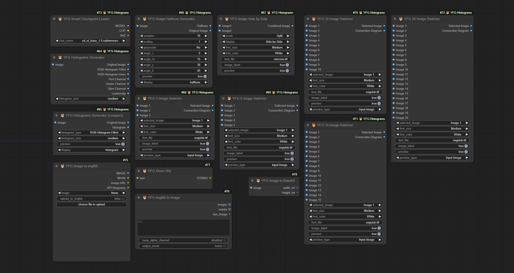

  

# YFG Comical ComfyUI Custom Nodes 

A collection of ComfyUI utility custom nodes. Hope these provide some functionality not offered in the core app or other custom nodes.

## Nodes

### Image Histograms Generator

This node allows you to take an input image, calculate its histogram for the color channels as well as the L channel and display a graphical representation of the data.

### Image Histograms Generator (compact)

This version of the node reduces the number of outputs to just two: Original and Histogram. You have a choice of using the node as a preview node and chose what to display in the node: The selected Histogram or the Orginal Image. The Histogram output will send the selected Histogram to the next node. 

### Image Halftone Generator

*This node is based on original code by Phil Gyford https://github.com/philgyford/python-halftone and ComfyUI node by aimingfail https://civitai.com/models/143293/image2halftone-node-for-comfyui*

This node generates a halftone image from the input image. It can self-display and send the output to other downstream nodes. You have a choice of displaying the Original Image or the generated Halftone image. The display can also be turned off. 

### Image Side by Side

This node generates either a Side-by-Side image of a Split image from two input images. You can turn on node self-preview or send the resulting image to other downstream nodes. The header labels can be turned off and the font, size and color can also be selected. 

Here is an example of the images Side by Side instead of split.

### Image to imgBB

These nodes enable uploading and downloading to / from the [imgBB](https://www.imgbb.com/) image sharing service. Also included are nodes for downloading images from imgBB and an image URL node that preserves the uploaded image URL in the workflow for easy sharing of originals with others. 
Perfect for sharing workflows while making original images available for others. 

#### Setup

In order to use these nodes, you must have an account with imgBB service. Once you have your account, navigate to [`https://api.imgbb.com/`](https://api.imgbb.com) and generate an API key. You will need to configure this key in the `imgbb_api_key.json` file in the node's subfolder `./loaders/`. 
There is a sample file `imgbb_api_key_example.json` you can copy and rename to `imgbb_api_key.json`, edit it and enter your API key replacing the text `"YOUR_API_KEY_HERE"` with your key. See example below.  

>     {
>       "api_key": "8a54a1b12353d43105d62fxadr3286a3323x"
>     }

### Smart Checkpoint Loader

This is a one-for-one replacement of the core Load Checkpoint node with one key difference: It flattens your directory structure regardless of how complex and makes all checkpoints appear as if on one folder. This is ideal for sharing workflows where the original author may have
a different directory structure than other users. Makes organizing checkpoints and sharing workflows easier. 

### Mono Clip

Generates a black and white or greyscale clipped image. Choice of three options with reverse mode for each. Suitable for masking and special effects. 

*This node is based on original code by XSS https://civitai.com/models/24869?modelVersionId=29755*

### VAE  Decode with Preview

Generates a black and white or greyscale clipped image. Choice of three options with reverse mode for each. Suitable for masking and special effects. 

*This node is based on original code by XSS https://civitai.com/models/24869?modelVersionId=47776*

### Image to Contrast Mask

Generates a greyscale contrast mask. Threshold is selectable between 1 and 255 for low and high values. Optionally blur the output. 

*This node is based on original code by XSS https://civitai.com/models/24869?modelVersionId=32717*

### PixelArt

Generates a Pixel Art style image. Optionally select the interpolation mode and number of pixels. 

*This node is based on original Mosaic code by XSS https://civitai.com/models/24869?modelVersionId=29750*

## Examples

### Sample Workflow

The workflow should be embedded in the file. If you can't get it to load, feel free to download and open the [workflow.json](workflows/ComfyUI_YFG_Comical-Example-Workflow.json) file.

## All nodes as of 06-08-2024

## Acknowledgements

I have to give credit to at least those who's other custom nodes I use quite often and in some cases make my life in ComfyUI all around better.

 - [ComfyUI](https://github.com/comfyanonymous/ComfyUI)
 - [MarasIT](https://github.com/davask/ComfyUI-MarasIT-Nodes)
 - [Dr.Lt.Data](https://github.com/ltdrdata)
 - [melMas](https://github.com/melMass/comfy_mtb)
 - [rgthree](https://github.com/rgthree/rgthree-comfy)
 - [Akatsuzi](https://github.com/Suzie1)
 - [chrisgoringe](https://github.com/chrisgoringe/cg-use-everywhere)
 - [pythongosssss](https://github.com/pythongosssss)

 And many many others too many to name. Your inspiration and talent is really exemplary. Thank you.
 