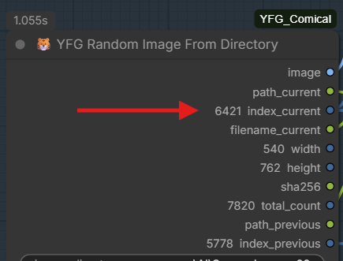
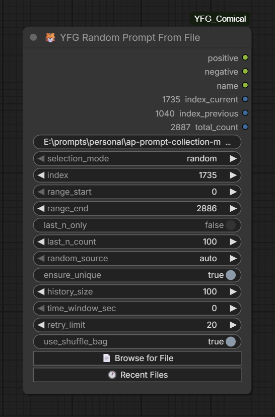
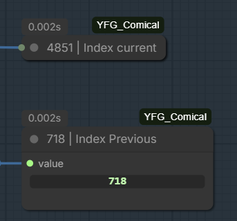
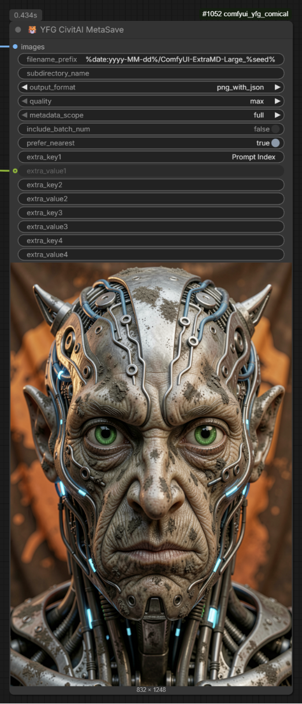
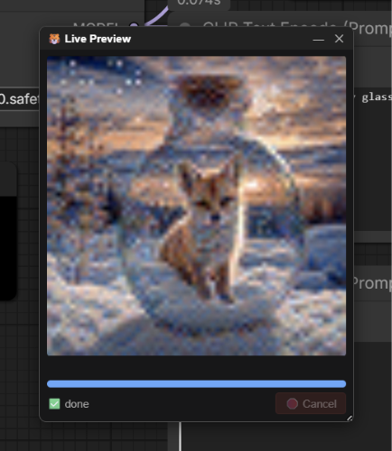

<p align="center">
  
</p>

<div align="center">

# YFG Comical ComfyUI Custom Nodes

</div>

A collection of ComfyUI utility custom nodes. These provide functionality not offered in the core app or other custom nodes. Several nodes enhance existing ideas with improved UX and quality-of-life features.

---

- [YFG Comical ComfyUI Custom Nodes](#yfg-comical-comfyui-custom-nodes)
  * [Nodes](#nodes)
    + [Image Histograms Generator](#image-histograms-generator)
    + [Image Histograms Generator (compact)](#image-histograms-generator-compact)
    + [Image Halftone Generator](#image-halftone-generator)
    + [Image Side by Side](#image-side-by-side)
    + [Image to imgBB](#image-to-imgbb)
      - [Setup](#setup)
    + [Smart Checkpoint Loader](#smart-checkpoint-loader)
    + [Mono Clip](#mono-clip)
    + [VAE Decode with Preview](#vae-decode-with-preview)
    + [Image to Contrast Mask](#image-to-contrast-mask)
    + [PixelArt](#pixelart)
    + [Text Mask Overlay](#text-mask-overlay)
    + [Image Switchers](#image-switchers)
    + [Random.org True Random Number](#randomorg-true-random-number)
    + [Random.org True Random Number (V2)](#randomorg-true-random-number-v2)
	+ [Random Image From Directory](#random-image-from-directory)
	+ [Random Prompt From File](#random-prompt-from-file)
	+ [Display Value](#display-value)
	+ [CivitAI MetaSave](#civitai-metasave)
	+ [Live Preview Panel](#live-preview-panel)
  * [Examples](#examples)
    + [Sample Workflow](#sample-workflow)
  * [All nodes as of 06-13-2024](#all-nodes-as-of-06-13-2024)
  * [Acknowledgements](#acknowledgements)

<small><i><a href="http://ecotrust-canada.github.io/markdown-toc/">Table of contents generated with markdown-toc</a></i></small>

---

## Nodes

### Image Histograms Generator


Calculate image histograms for RGB channels and L (luminance); displays a graphical representation.

### Image Histograms Generator (compact)


Reduces outputs to just two: Original and Histogram. Can self-preview (original or histogram) and forward the selected histogram downstream.

### Image Halftone Generator


*Based on original code by Phil Gyford and ComfyUI node by aimingfail.*

Generates halftone from an input image; can self-display or send output to other nodes.

### Image Side by Side


Creates a side-by-side or split image from two inputs. Optional self-preview, headers (font/size/color), and label toggles.

Example (side-by-side instead of split):


### Image to imgBB


Upload and download images to/from [imgBB](https://www.imgbb.com/). Includes nodes for downloading images and a URL "storage" node that keeps the original link alongside the workflow.

#### Setup

Create `imgbb_api_key.json` under `./loaders/`:

```json
{
  "api_key": "YOUR_API_KEY_HERE"
}
```

Obtain a key at <https://api.imgbb.com/>.

### Smart Checkpoint Loader


Drop-in replacement for the core "Load Checkpoint," but flattens complex directory trees so checkpoints appear as if in a single folder — ideal for sharing workflows.

### Mono Clip


Produces B/W or grayscale clipped images with three modes (each reversible). Useful for masks and stylization.

*Based on original code by XSS.*

### VAE Decode with Preview


VAE decode with inline preview and QoL options.

*Based on original code by XSS.*

### Image to Contrast Mask


Creates a grayscale contrast mask. Select low/high thresholds (1–255), optional blur.

*Based on original code by XSS.*

### PixelArt


Generates pixel-art style images. Choose interpolation and pixel size.

*Based on original Mosaic code by XSS.*

### Text Mask Overlay


Enhances the idea by Yuigahama Yui:

- Choose fonts from System, User, or local `./fonts/` directory.
- Built-in Mask-to-Image conversion (no extra converter needed).

**Example**

| <a href="img/textMaskOverlay01original.png"></a> | <a href="img/textMaskOverlay01.png"></a> |
| :-: | :-: |
| Original | Output |

Example [workflow JSON](workflows/ComfyUI_YFG_Comical-Text-Mask-Overlay-Workflow.json) (also embedded in the image below):

[](workflows/ComfyUI_YFG_Comical-Text-Mask-Overlay-Workflow.png)

*Based on the ComfyUI-Text node by Yuigahama Yui.*

### Image Switchers


Multi-input image switchers (3, 5, 10, 15, 20 inputs). Provide a routing matrix, inline preview, and graceful handling of missing inputs (with user warnings). Designed to avoid "ganged" switcher confusion in complex workflows.


### Random.org True Random Number


Modified version of the WAS node (original wasn't functioning). Requires a [Random.org](https://www.random.org/) account and [API key](https://api.random.org/dashboard).

*Based on original code by WASasquatch.*

---

### Random.org True Random Number (V2)


Integrates with the [random.org JSON-RPC API](https://api.random.org/json-rpc/2/) to generate **true random numbers** from atmospheric noise.

#### ✨ Features

- **Secure API key handling**  
  Key is **not** exposed in UI, workflow JSON, or image metadata. Loaded at runtime from:
  1. Environment variable `RANDOM_ORG_API_KEY`, or
  2. Local JSON file `random_org_api_key.json` next to `RandomOrgV2.py`.

- **Flexible outputs**  
  Emits three types for broad node compatibility:
  - `NUMBER`
  - `FLOAT`
  - `INT`

- **Optional uniqueness filtering (in-memory)**  
  Avoid repeats within a Python session:
  - `ensure_unique` — toggle de-duplication
  - `unique_scope` — `"range"` (per `[min, max]`) or `"global"` (across all ranges)
  - `history_size` — how many values to remember
  - `time_window_sec` — ignore duplicates older than this window
  - `retry_limit` — extra draws to try before giving up

- **Backwards compatible**  
  Old node remains available as `RandomOrgTrueRandomNumber_node`.  
  New node is `RandomOrgV2TrueRandomNumber_node`.

#### 🔑 API Key Setup

1. Create `random_org_api_key.json` next to `RandomOrgV2.py`:

   ```json
   {
     "api_key": "YOUR_API_KEY_HERE"
   }
   ```

2. Or set an environment variable before launching ComfyUI:

   ```bash
   export RANDOM_ORG_API_KEY=YOUR_API_KEY_HERE
   ```

   On Windows (PowerShell):

   ```powershell
   setx RANDOM_ORG_API_KEY "YOUR_API_KEY_HERE"
   ```

#### ⚙️ Example Usage

- **Generate a random integer between 1 and 100**
  - `minimum = 1`
  - `maximum = 100`
  - `mode = random`

- **Ensure no repeats in the current range**
  - Enable `ensure_unique`
  - Set `unique_scope = range`
  - Adjust `history_size` and `time_window_sec`

#### 📌 Notes

- **Session-lifetime uniqueness** resets when Python restarts.  
- **Persistence** (disk-based history) may be added in a future version.  
- **API limits**: Random.org quotas apply — check your dashboard.

### Random Image From Directory


This node selects a single image from a given directory (with optional recursion into subdirectories).  
It supports **true randomness** (via Random.org integration if configured) or deterministic selection by index/filename.  
It also tracks previously selected images so you can compare "current" vs "previous" outputs.

#### ✨ Features
- **Built-in directory browser**
  - **📁 Browse for Directory** button opens a navigable server-side folder picker — no need to type paths manually.
  - **🕐 Recent Directories** button shows an MRU list of previously used directories for quick re-selection.
  - Used directories are saved automatically to `yfg_dir_history.json` on each run.
- **Inline output value display**
  - Key output values (`index_current`, `width`, `height`, `total_count`, `index_previous`) are shown directly on the output slots after each run — no external display nodes needed.
  - 
- **Directory traversal**
  - Select only from the top folder, or include all subdirectories.
- **Multiple selection modes**
  - `random`: choose a random image (true random if Random.org is enabled, otherwise local PRNG).
  - `by_index`: pick image by numeric index (clamped to valid range — no wrap-around).
  - `by_filename`: select a file by exact name or substring.
  - `by_query`: glob-style matching (`*.png`, `cat*`, etc.), random among matches.
- **Uniqueness filtering**
  - Avoids repeating the same file within the same session.
  - Scope can be per-directory or global.
  - Adjustable `history_size` and `time_window_sec` for fine control.
- **Metadata outputs**
  - Current/previous file info, image size, and SHA256 hash of the file.
  - Also reports `total_count` = number of eligible images found.

#### 🔧 Input Parameters
- **`image_directory`** *(string)* – Path to the folder containing images.  
- **`include_subdirs`** *(bool, default: True)* – Whether to scan subdirectories.  
- **`selection_mode`** *(choice, default: random)* – Image selection method.  
- **`index`** *(int)* – Used when `selection_mode=by_index`.  
- **`filename_query`** *(string)* – Used when `selection_mode=by_filename` or `by_query`.  
- **`random_source`** *(choice, default: auto)* –  
  - `auto`: use Random.org if API key is configured, else local PRNG.  
  - `local`: always use local PRNG.  
  - `random_org`: force Random.org usage (requires API key).  
- **`ensure_unique`** *(bool)* – Prevent repeats during a session.  
- **`unique_scope`** *(choice)* – `"directory"` or `"global"`.  
- **`history_size`** *(int, default: 512)* – Max remembered items.  
- **`time_window_sec`** *(int, default: 0)* – Forget items older than this many seconds.  
- **`show_preview`** *(bool, default: False)* – Show a preview thumbnail on the node after each run.
- **`retry_limit`** *(int, default: 16)* – Max retries when avoiding duplicates.

#### 🖥️ Outputs
1. **`image`** – The loaded image tensor.  
2. **`path_current`** – Full path of the selected image (current).  
3. **`index_current`** – Index of the selected image (current).  
4. **`filename_current`** – Filename of the selected image.  
5. **`width`** – Width of the image in pixels.  
6. **`height`** – Height of the image in pixels.  
7. **`sha256`** – SHA256 checksum of the file (useful for deduplication).  
8. **`total_count`** – Total number of eligible images discovered in the directory (after filters).  
9. **`path_previous`** – Full path of the image from the previous run.  
10. **`index_previous`** – Index of the image from the previous run.  

#### 🔑 Random.org Setup (optional)
- To enable true randomness, place your API key in `random_org_api_key.json` next to the node:
1. Create `random_org_api_key.json` next to `RandomOrgV2.py`:

   ```json
   {
     "api_key": "YOUR_API_KEY_HERE"
   }
   ```

2. Or set an environment variable before launching ComfyUI:

   ```bash
   export RANDOM_ORG_API_KEY=YOUR_API_KEY_HERE
   ```

   On Windows (PowerShell):

   ```powershell
   setx RANDOM_ORG_API_KEY "YOUR_API_KEY_HERE"
   ```
#### 📌 Notes

- **Current vs previous outputs** make it easy to compare selections.
- **Session-lifetime uniqueness** resets when Python restarts.
- **Directory history** is persisted to `yfg_dir_history.json` and survives restarts (max 50 entries).
- **API limits**: Random.org quotas apply — check your dashboard.

---

### Random Prompt From File



Selects a single prompt entry from a `.txt` prompt file using true random.org numbers (or local PRNG). Outputs `positive`, `negative`, and `name` text directly — no additional nodes or wiring required.

#### ✨ Features
- **Built-in file browser**
  - **📄 Browse for File** button opens a navigable server-side file picker showing directories and `.txt` files, with a live prompt count badge per file.
  - **🕐 Recent Files** button shows an MRU list of previously used files for quick re-selection.
  - Used files are saved automatically to `yfg_file_history.json` on each run.
- **Auto range population**
  - `range_start` and `range_end` fill automatically (0 and total−1) whenever a file is selected — no manual entry needed.
- **Last-N toggle**
  - `last_n_only` restricts the random pool to the last N entries in the file — ideal when new prompts are appended to the bottom and you want to pick only from the newest additions.
- **Inline output value display**
  - `index_current`, `index_previous`, and `total_count` are shown directly on the output slots after each run.
- **INDEX auto-sync**
  - The INDEX widget updates automatically after every run so switching to `by_index` mode requires no manual typing.
- **True random.org integration**
  - Uses the same Random.org API key as the Random Number nodes — no separate setup needed.
- **Uniqueness filtering**
  - Avoids repeating prompts within a session with configurable history size and time window.
- **Shuffle bag**
  - Cycles through all prompts in the pool before repeating, then reshuffles — guarantees uniform coverage.

#### 📄 Prompt File Format

```
positive: your positive prompt here

negative: ugly, deformed, watermark

----
positive: second prompt

negative:

name: Optional Label
----
```

- Entries separated by any number of hyphens (`-`, `--`, `----`) on their own line
- `negative:` content may be empty
- `name:` is optional — defaults to the filename stem
- Leading/trailing separator lines are silently ignored
- UTF-8 encoding required

#### 🔧 Input Parameters
- **`prompt_file`** *(string)* – Path to the `.txt` prompt file. Use **📄 Browse** or **🕐 Recent** buttons.
- **`selection_mode`** *(choice, default: random)* – `random` picks from `range_start`..`range_end`; `by_index` uses the INDEX widget directly.
- **`index`** *(int)* – Used when `selection_mode=by_index`. Auto-syncs after every run.
- **`range_start`** *(int, default: 0)* – First prompt index in the random pool. Auto-fills to 0 when a file is selected.
- **`range_end`** *(int, default: 0)* – Last prompt index in the random pool. Auto-fills to total−1 when a file is selected. 0 = last prompt.
- **`last_n_only`** *(bool, default: False)* – When ON, restricts the pool to the last N entries only.
- **`last_n_count`** *(int, default: 100)* – How many entries from the end to include when `last_n_only` is ON.
- **`random_source`** *(choice, default: auto)* – `auto`, `local`, or `random_org`.
- **`ensure_unique`** *(bool, default: True)* – Avoid repeating prompts within a session.
- **`history_size`** *(int, default: 100)* – How many recent indices to track for uniqueness.
- **`time_window_sec`** *(int, default: 0)* – Forget entries older than this many seconds.
- **`retry_limit`** *(int, default: 20)* – Max attempts before falling back to last candidate.
- **`use_shuffle_bag`** *(bool, default: True)* – Cycle through all prompts before repeating, then reshuffle.

#### 🖥️ Outputs
1. **`positive`** – Positive prompt text.
2. **`negative`** – Negative prompt text (empty string if not specified in file).
3. **`name`** – Prompt name from the `name:` field, or filename stem if omitted.
4. **`index_current`** – 0-based index of the selected prompt. Auto-syncs to INDEX widget.
5. **`index_previous`** – Index of the prompt selected in the previous run this session.
6. **`total_count`** – Total number of valid prompts found in the file.

#### 🔑 Random.org Setup (optional)
Uses the same `random_org_api_key.json` file as the Random Number nodes — see [Random.org True Random Number (V2)](#randomorg-true-random-number-v2) for setup instructions.

#### 📌 Notes
- **Session-lifetime uniqueness** resets when Python restarts.
- **File history** is persisted to `yfg_file_history.json` and survives restarts (max 20 entries).
- **File cache** — parsed prompt files are cached in memory keyed by modification time. Re-parsing only occurs when the file changes on disk — zero overhead on repeat runs.
- **API limits**: Random.org quotas apply — check your dashboard.

---

### Display Value



A minimal utility node that displays any value — `INT`, `FLOAT`, or `STRING` — inline in both the node body and the title bar. Designed to replace large display nodes (like `ShowText` or `Display Int`) wherever a compact read-only indicator is all that's needed.

#### ✨ Features
- **Title bar display** — value shown as `value | label` so it's always visible even when the node is collapsed to its smallest size.
- **In-body display** — green value rendered in the node body when expanded, no extra height added.
- **Rename to label** — double-click the node title in ComfyUI to set a custom label (e.g. `Index`, `Width`, `Seed`). The value is appended automatically after each run.
- **Any type** — accepts `INT`, `FLOAT`, or `STRING` on the single input slot via wildcard.
- **Persistent** — last value is saved into the workflow JSON and pre-filled on reload.

#### 🔧 Inputs
- **`value`** *(any)* – The value to display.

#### 📌 Notes
- No outputs — this is a pure display/monitoring node.
- The node title format is `value | label`. Rename the node to change the label; the value portion updates automatically on each run.

---

### CivitAI MetaSave



Saves images with full **A1111-compatible metadata** embedded so that [CivitAI](https://civitai.com/) automatically recognizes and displays generation info — model, LoRA weights, embeddings, sampler settings, seed, and prompts — exactly as it does for Automatic1111 outputs.

A single node replaces the two-node workflow required by other metadata extensions. Four optional custom key/value extra-metadata pairs are built directly into the node — no helper nodes required.

Compatible with classic SD (KSampler, KSamplerAdvanced), Flux, SD3, Ideogram, SamplerCustomAdvanced, LoRA, and upscale workflows.

#### ✨ Features
- **CivitAI auto-recognition** — embeds the `parameters` text chunk that CivitAI parses for resources, prompts, and settings, identical to A1111 output.
- **Multi-format output** — PNG, JPEG, or WebP, each with an optional sidecar workflow JSON.
- **EXIF embedding** — JPEG and WebP outputs also receive EXIF UserComment metadata so CivitAI can read them regardless of format.
- **Model & resource hashing** — SHA-256 hashes (first 10 hex chars) for checkpoint, VAE, LoRA, and embedding files are computed and cached on disk to avoid redundant re-hashing.
- **LoRA detection** — finds LoRA weights from both LoraLoader nodes and inline `<lora:name:weight>` syntax in the prompt text.
- **Filename tokens** — supports `%date:yyyy-MM-dd%`, `%seed%`, `%model%`, `%pprompt:32%`, `%nprompt:32%`, `%width%`, `%height%` in the filename prefix.
- **Subdirectory support** — optional sub-folder creation inside the output directory, also supporting date tokens.
- **Metadata scope control** — choose what gets embedded: full, default, parameters only, workflow only, or none.
- **Four inline extra metadata slots** — attach custom key/value pairs (e.g. workflow name, prompt index, project tag) without any additional nodes.

#### 🔧 Input Parameters
- **`images`** *(IMAGE)* – Images to save.
- **`filename_prefix`** *(string, default: `ComfyUI`)* – Output filename prefix. Supports tokens: `%date:yyyy-MM-dd%`, `%seed%`, `%model%`, `%pprompt:32%`, `%nprompt:32%`, `%width%`, `%height%`.
- **`subdirectory_name`** *(string)* – Optional sub-folder inside the output directory. Supports `%date%` tokens. Leave blank to use the default output folder.
- **`output_format`** *(choice, default: `png_with_json`)* – Image format. The `*_with_json` variants also write a sidecar `.json` workflow file.
  - `png` / `png_with_json`
  - `jpg` / `jpg_with_json`
  - `webp` / `webp_with_json`
- **`quality`** *(choice, default: `max`)* – Output quality level. Ignored for PNG.
  - `max` — 100 (lossless WebP)
  - `high` — 80
  - `medium` — 60
  - `low` — 30
- **`metadata_scope`** *(choice, default: `full`)* – Controls what metadata is embedded.
  - `full` — A1111 parameters string + full ComfyUI workflow JSON
  - `default` — same as the built-in SaveImage node
  - `parameters_only` — A1111-style parameters string only
  - `workflow_only` — ComfyUI workflow JSON only
  - `none` — no metadata
- **`include_batch_num`** *(bool, default: `false`)* – Append a 5-digit batch index to the filename when saving multiple images.
- **`prefer_nearest`** *(bool, default: `true`)* – When multiple upstream nodes provide the same field, prefer the one closest (fewest graph hops) to this node.
- **`extra_key1`** / **`extra_value1`** *(string, optional)* – Custom metadata key/value pair 1.
- **`extra_key2`** / **`extra_value2`** *(string, optional)* – Custom metadata key/value pair 2.
- **`extra_key3`** / **`extra_value3`** *(string, optional)* – Custom metadata key/value pair 3.
- **`extra_key4`** / **`extra_value4`** *(string, optional)* – Custom metadata key/value pair 4.

#### 📌 Notes
- **`piexif`** must be installed (`pip install piexif`). It is listed as a dependency in `pyproject.toml` and should install automatically via ComfyUI Manager.
- **Hash cache** is stored in `civitai_metasave/.cache/model_hash_cache.json`. Hashes are computed once per file and reused on subsequent runs — no performance penalty after the first generation.
- **Steps are required** for full metadata. If no Steps value is found upstream, the parameters string is skipped and a warning is printed to the console. This is a CivitAI requirement, not a bug.
- **Workflow attribution** — derived from [comfyui_image_metadata_extension](https://github.com/edelvarden/comfyui_image_metadata_extension) by edelvarden which itself was a fork of [ComfyUI-SaveImageWithMetaData](
nkchocoai/ComfyUI-SaveImageWithMetaData). Maintained and extended independently as part of YFG Comical.

### Live Preview Panel



A floating, draggable **live preview window** that mirrors the KSampler preview so you can watch generation progress from anywhere in your workflow — no more panning back and forth to the sampler node to check on a render or catch a bad generation early.

This is a pure frontend extension — it has **no node**, no inputs, and no outputs. It simply appears as a floating panel over the canvas, similar to ComfyUI's built-in minimap. Under the hood it listens to the same websocket events (`progress` and `b_preview`) that drive the KSampler's own inline preview, so it adds zero backend overhead.

#### ✨ Features
- **Live preview image** — updates in real time as the sampler works, exactly like the in-node preview.
- **Progress bar & step counter** — shows `step N / M (%)` for the currently executing node.
- **Executing node indicator** — displays the title and ID of whichever node is currently running (e.g. `▶ KSampler (#53)`).
- **🛑 Cancel button** — interrupts the current generation from anywhere, without touching the sampler node.
- **Drag & resize** — move it by the header, resize from the bottom-right grip. Position and size are remembered between sessions.
- **Collapse & hide** — `—` collapses to just the title bar; `✕` hides the panel (it reappears automatically on the next run).
- **Keyboard toggle** — **`Alt+Shift+L`** shows/hides the panel at any time.
- **Settings switch** — a master on/off toggle in ComfyUI Settings (search for "YFG"): **🐯 Enable Live Preview panel**. When off, the panel never appears, even during generations.

#### 📌 Notes
- Previews require ComfyUI's preview generation to be enabled (the default). If you launch ComfyUI with `--preview-method none`, the panel will still show progress and the executing node, but no image.
- The panel auto-appears whenever a generation starts (unless disabled in Settings). If you close it with `✕`, it comes back on the next run — or press `Alt+Shift+L` to bring it back immediately.
- The hotkey deliberately avoids `Alt+Shift+P`, which is reserved by Microsoft Edge for tab grouping.

---

## Examples

### Sample Workflow


If the embedded workflow doesn't load, use the JSON:  
[workflows/ComfyUI_YFG_Comical-Example-Workflow.json](workflows/ComfyUI_YFG_Comical-Example-Workflow.json)

## All nodes as of 06-13-2024


## Acknowledgements

Huge thanks to creators whose work inspires or integrates with these nodes:

- [ComfyUI](https://github.com/comfyanonymous/ComfyUI)
- [MarasIT](https://github.com/davask/ComfyUI-MarasIT-Nodes)
- [Dr.Lt.Data](https://github.com/ltdrdata)
- [melMas](https://github.com/melMass/comfy_mtb)
- [rgthree](https://github.com/rgthree/rgthree-comfy)
- [Akatsuzi](https://github.com/Suzie1)
- [chrisgoringe](https://github.com/chrisgoringe/cg-use-everywhere)
- [pythongosssss](https://github.com/pythongosssss)
- [edelvarden](https://github.com/edelvarden/comfyui_image_metadata_extension)

…and many others. Thank you for your talent and generosity.
